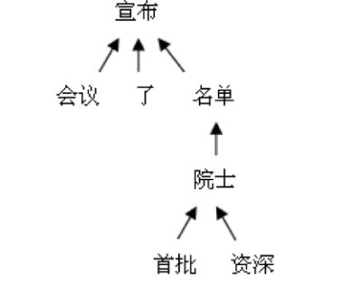

# Web Info Lab 2 - 实体/关系抽取

[TOC]

<center><h5>PB18000058 丁垣天<br/> PB18000028 邱子悦</h5></center>

## 1 实验目的

## 2 实验简介

本次实验采用两种不同的思路来完成关系抽取和实体识别的任务，并比较它们效果上的差异。两种方法的大题思路如下：

* 直接分类方法：直接将整个问题作为一个分类问题实现，即使用某种特定的分类算法（本实验采用`distilbert` 算法），把每句话分类成不同的关系类型（如 `Component-Whole`） 。
* 实体抽取 + 依存树方法：先对实体进行抽取，并选择两个最相关的实体，然后提取这两个实体在依存树上的路径（最短依存路径），然后将路径放入分类模型进行分类。即

$$
实体抽取 \to 构建依存树并搜索最短依存路径 \to 放入分类模型分类
$$

具体过程参考[实验过程](## 4 实验过程)

## 3 实验说明


实验目录结构

```python
exp2                        # 根目录
├── dataset
│   ├── test.txt            # 测试数据集
│   └── train.txt           # 训练数据集
├── models
│   ├── distilbert-classify # 分类模型
│   ├── distilbert-deps     # 基于依存树的分类模型
│   └── distilbert-ner      # 命名实体识别模型
├── outputs
│   ├── output1.txt         # 直接分类方法的输出
│   └── output2.txt         # 实体识别 + 依存树分类方法的输出
├── README.md               # 运行说明
├── report.md               # 实验报告
├── src
│   ├── dataset.py          # 读取数据集
│   ├── dependency.py       # 处理依存树
│   ├── models.py           # 模型的实现
└── train.ipynb             # 使用该notebook来进行训练
└── test.ipynb              # 使用该notebook来测试运行效果
```

## 4 实验过程

### 4.1 直接分类方法

由于本实验只要求在一个句子中找出最合适的一对关系，故可以直接最简单地采用文本分类的方法。下面介绍我们实现文本分类的具体思路。

#### 4.1.1 分类模型的选择

本实验要在一个句子中找出最合适的一对实体和它们之间的关系，但很多情况下难以确定哪一对实体更为合适，比如下面的例子：

```
Prior to the 4004, engineers built computers either from collections of chips or from discrete components.
```

助教在实验二在线评测说明中给出的关系抽取结果为：`Instrument-Agency&chips,engineers` ，但想要从这一句话的诸多实体对中选择出 `chips`和`engineers` 这一对实体是一件非常难以理解的事情，而一旦选择 `engineers` 和 `computers` 这一对实体，关系抽取的结果就应当为 `Product-Producer` 。从这个例子可以看出来，该问题具有很强的非线性性。**很难使用传统的机器学习方法（决策树、SVM、CRF）等方法求解，必须使用深度神经网络才能得到比较好的结果。**

但是另一方面，本次实验的数据集相对而言比较小，使用特别复杂的神经网络，非常容易产生过拟合，故为了防止过拟合，我们使用一下两个策略：

* 使用迁移学习，即使用已经训练好的模型辅助训练。
* 使用知识蒸馏模型，知识蒸馏模型往往具有层数比较少的网络和较少的参数，不容易引起过拟合。

所以我们选择非常知名的 `distilbert` 模型进行迁移学习，该模型拥有与 `BERT` 相似的效果，但使用了更浅的网络和更少的参数。可以帮助我们在该问题上达到一个比较好的效果（`validation 63%`）。

#### 4.1.2 `distilbert` 模型

https://arxiv.org/pdf/1910.01108.pdf

#### 4.1.3 模型的训练

由于本实验的数据量很小，故直接在CPU上做训练，本次实验使用 python包 `simpletransformers` 来完成训练。

实现相应的模型：

```python
from simpletransformers.classification import ClassificationModel

class ClassifyModel:
    def __init__(self, path: str):
        """Create/Load a new Model

        Args:
            path (str): if this path exists, then load the model, otherwise it will create a new model at the path.
        """
        self.path = path
        try:
            # load saved model.
            self.model = ClassificationModel("distilbert", path, use_cuda=False)
        except:
            # download a copy of the standard model.
            self.model = ClassificationModel(
                "distilbert", "distilbert-base-uncased",
                num_labels=len(relation_list), use_cuda=False
           	) 
    
    def train(self, train_data: Iterator[Tuple[str, str]]):
        """ Train the model. 

        Args:
            train_data (Iterator[Tuple[str, str]]):
            	An Iterator of the pairs of input sentence and the corresponding label.
        """
        data = [ (sent, relation_list.index(rela)) for sent, rela in train_data]
        train_df = pd.DataFrame(data) # cast to Dataframe
        self.model.train_model(train_df, output_dir=self.path)
    
    def predict(self, data: Iterable[str]) -> List[str]:
        """Use the Model to predict the label of sentence.

        Args:
            data (Iterable[str]): iterable of input sentence string.

        Returns:
            List[str]: list of labels.
        """
        predictions, _ = self.model.predict(list(data))
        return [ relation_list[i] for i in predictions]
```

### 4.2 实体抽取 + 依存树方法

虽然使用上面的代码可以实现很好的效果，但上面的办法并不能获得题目要求的实体对，同时，其结果也不具有很好的可解释性。故我们需要有一个专门的方法来获取实体对，根据提取出来的实体对进行进一步的分类。

该方法的整体思路如下：
$$
实体抽取 \to 构建依存树并搜索最短依存路径 \to 放入分类模型分类
$$

#### 4.2.1 依存树和最短依存路径

依存树用于描述各个词语之间的依存关系。能够指出了词语之间在句法上的搭配关系。通过依存树，我们可以对句子之间的联系有一个比较好的把握。



两个实体之间的最短依存路径则是将依存树作为一个无向图，两个实体之间最短的那一条路径，比如：

```python
from src.dependency import DepTree

tree = DepTree("The lawsonite was contained in a platinum crucible and the counter-weight was a plastic crucible with metal pieces.")

tree.shortest_path("lawsonite", "crucible")
```

返回的结果为：

```
['lawsonite', 'contained', 'in', 'crucible']
```

依存路径中间的几个点的内容（`["contained", "in" ]` ），已经两个实体本身的性质（`["lawsonite", "crucible"]`），可以比较好的表现出两个实体之间的关系（`Content-Container`）。

该方法可以有效的利用两个实体之间的关系给出分类结果，**但是由于实体识别的精准度不够，所以该方法的效果受到了一定的限制**。但在实体识别和分类模型选择适当的时候仍然可以达到 `validation 59%` 的结果。

#### 4.2.2 计算两个实体的最短依存路径

本次实验使用 `spacy` 来生成依存树， `networkx` 来计算最短路径，代码如下：

```python
dep_tree_nlp = spacy.load("en_core_web_sm")

class DepTree:
    def __init__(self, sentence: str):
        """Initialize a dependency tree.

        Args:
            sentence (str): input sentence.
        """
        sentence = preprocessing(sentence)
        self.doc = dep_tree_nlp(sentence) # 使用 spacy 提取依存树
        edges = []
        for token in self.doc:
            edges.append((token.head.i, token.i))
        self.graph = nx.Graph(edges)  # 使用 networkx 构建一张无向图
    
    def shortest_path(self, src: str, dest: str) -> List[str]:
        """Get the shorest path in the dependency graph.

        Args:
            src (str): source vertex(entity)
            dest (str): destination vertex(entity)

        Returns:
            List[str]: shortest path
        """
        src_pos = self.search(src)
        dest_pos = self.search(dest)
        # 调用 networkx 的最短路径算法
        pos_path = nx.shortest_path(self.graph, source=src_pos, target=dest_pos)
        return [ self.doc[i].text for i in pos_path if self.doc[i].text not in stopwords]
```

##### 停用词的处理

实现过程中，使用进行了去停用词处理，但由于 `nltk` 提供的停用词表包含了一些对关系判断至关重要的介词，故要重新选择一个停用词表，选择的停用词表如下：

```python
stopwords = {
    'i', 'me', 'my', 'myself', 'we', 'our', 'ours', 'ourselves', 'you',
    "you're", "you've", "you'll", "you'd", 'your', 'yours', 'yourself',
    'yourselves', 'he', 'him', 'his', 'himself', 'she', "she's", 'her',
    'hers', 'herself', 'it', "it's", 'its', 'itself', 'they', 'them',
    'their', 'theirs', 'themselves', 'what', 'which', 'who', 'whom',
    'this', 'that', "that'll", 'these', 'those', 'am', 'is', 'are', 'was',
    'were', 'be', 'been', 'being', 'have', 'has', 'had', 'having', 'do',
    'does', 'did', 'doing', 'a', 'an', 'the', 'and', 'but', 'then', 'once',
    'here', 'there', 'when', 'where', 'why', 'how', 'all', 'any', 'both',
    'each', 'few', 'more', 'most', 'other', 'some', 'such', 'no', 'nor', 'not',
    'only', 'own', 'same', 'so', 'than', 'too', 'very', 's', 't', 'can', 'will',
    'just', 'don', "don't", 'should', "should've", 'now', 'd', 'll', 'm', 'o', 're',
    've', 'y', 'ain', 'aren', "aren't", 'couldn', "couldn't", 'didn', "didn't", 'doesn',
    "doesn't", 'hadn', "hadn't", 'hasn', "hasn't", 'haven', "haven't", 'isn',
    "isn't", 'ma', 'mightn', "mightn't", 'mustn', "mustn't", 'needn', "needn't", 'shan', "shan't", 'shouldn', "shouldn't", 'wasn', "wasn't", 'weren', "weren't", 'won', "won't", 'wouldn', "wouldn't"
}
```

#### 4.2.3 训练实体识别和依存路径分类两个模型

最后要实现实体识别和依存路径的分类。

## 5 实验结果

